## **What is Machine Learning?**

Machine learning (ML) is a field of study in artificial intelligence concerned with the development and study of statistical algorithms that can learn from data and generalize to unseen data, and thus perform tasks without explicit instructions.

Machine learning approaches have been applied to many fields including natural language processing, computer vision, speech recognition, email filtering, agriculture, and medicine. ML is known in its application across business problems under the name predictive analytics. Although not all machine learning is statistically based, computational statistics is an important source of the field's methods.

The mathematical foundations of ML are provided by mathematical optimization (mathematical programming) methods. Data mining is a related (parallel) field of study, focusing on exploratory data analysis (EDA) through unsupervised learning. From a theoretical point of view Probably approximately correct (PAC) learning provides a framework for describing machine learning.

There are different types of machine learning we will focus on during the next sections of the course: Supervised Learning and Unsupervised Learning.

## **Supervised Learning.**

Supervised learning, also known as supervised machine learning, is a subcategory of machine learning and artificial intelligence. It is defined by its use of labeled datasets to train algorithms that to classify data or predict outcomes accurately. As input data is fed into the model, it adjusts its weights until the model has been fitted appropriately, which occurs as part of the cross validation process. Supervised learning helps organizations solve for a variety of real-world problems at scale, such as classifying spam in a separate folder from your inbox.

For example, a segment of text could have a category label, such as:
+ Spam vs. Legitimate Email,
+ Positive vs. Negative Movie Review.

The network receives a set of inputs along with the corresponding correct outputs, and the algorithm learns by comparing its actual 
output with correct outputs to find errors. It then modifies the model accordingly. Supervised learning is commonly used in applications where historical data predicts likely future events.

Supervised Learning process:

1. **Data Acquisition**: This is the first step and also one of the most important steps in the Machine Learning process. Data can be collected from various sources such as databases, APIs, web scraping or even manually. The data collected may include text, images, audio, video, etc.

2. **Data Cleaning**: Collected data is often not always ready to be used immediately. There can be many problems like missing data, noisy data, inconsistent data, etc. This step ensures that the data is properly prepared so that it can be used effectively in training the model.

3. **Model Training & Building**: Once the data has been cleaned and prepared, we can start building the Machine Learning model. There are different types of models such as supervised learning, unsupervised learning, reinforcement learning, etc. The model is then trained using the cleaned data.

4. **Model testing**: Once the model has been trained, we need to test its performance. This is typically done using a separate set of test data that the model has not seen during training. This helps evaluate the model's generalizability - that is, its ability to work with new data. If the model is not correct with the test data set, we will adjust the model parameters (Step 3).

5. **Model Deployment**: If the model has been tested and shows good performance, it can be deployed for actual use. This can include integrating the model into an application or service, or using the model to generate predictions or useful information from new data.

We often divide the data set with about 30% used to test the data and the remaining 70% used to run the data model.

What we just showed is a simplified approach to supervised learning, it contains an issue! Is it fair to use our single split of the data to evaluate our models performance? After all, we were given the chance to update the model parameters again and again.

To fix this issue, data is often split into 3 sets:

1. **Training Data**: This data is used to train the model parameters. During this process, the model learns to predict the output based on the input using training data.

2. **Validation Data**: This data is used to adjust the hyperparameters of the model. Hyperparameters are parameters that are not learned from training data but are set in advance. For example, the maximum depth of a decision tree is a hyperparameter. Validation data help us choose the best values for these hyperparameters.

3. **Test Data**: After the model has been trained and tuned, we use test data to evaluate the final performance of the model. This helps us understand the model's generalization ability, i.e. its ability to correctly predict the output for new data it has never seen during training.

This last measure is the measure by which we evaluate the actual performance of the model.

## **Underfitting and Overfitting.**

When we talk about the Machine Learning model, we actually talk about how well it performs and its accuracy which is known as prediction errors. Let us consider that we are designing a machine learning model. A model is said to be a good machine learning model if it generalizes any new input data from the problem domain in a proper way. This helps us to make predictions about future data, that the data model has never seen. Now, suppose we want to check how well our machine learning model learns and generalizes to the new data. For that, we have overfitting and underfitting, which are majorly responsible for the poor performances of the machine learning algorithms.

### **1. Bias and Variance in Machine Learning.**

+ Bias: Bias refers to the error due to overly simplistic assumptions in the learning algorithm. These assumptions make the model easier to comprehend and learn but might not capture the underlying complexities of the data. It is the error due to the model’s inability to represent the true relationship between input and output accurately. When a model has poor performance both on the training and testing data means high bias because of the simple model, indicating underfitting.

+ Variance: Variance, on the other hand, is the error due to the model’s sensitivity to fluctuations in the training data. It’s the variability of the model’s predictions for different instances of training data. High variance occurs when a model learns the training data’s noise and random fluctuations rather than the underlying pattern. As a result, the model performs well on the training data but poorly on the testing data, indicating overfitting.

### **2. Underfitting in Machine Learning.**

A statistical model or a machine learning algorithm is said to have underfitting when a model is too simple to capture data complexities. It represents the inability of the model to learn the training data effectively result in poor performance both on the training and testing data. In simple terms, an underfit model’s are inaccurate, especially when applied to new, unseen examples. It mainly happens when we uses very simple model with overly simplified assumptions. To address underfitting problem of the model, we need to use more complex models, with enhanced feature representation, and less regularization.

*Note:* The underfitting model has 'high bias' and 'low variance'.

Summary:

+ Reasons for Underfitting:

        a. The model is too simple, so it may be not capable to represent the complexities in the data.

        b. The input features which is used to train the model is not the adequate representations of underlying factors influencing the target variable.

        c. The size of the training dataset used is not enough.

        d. Excessive regularization are used to prevent the overfitting, which constraint the model to capture the data well.
        
        e. Features are not minimized.

+ Techniques to Reduce Underfitting:

        a. Increase model complexity.

        b. Increase the number of features, performing feature engineering.

        c. Remove noise from the data.

        d. Increase the number of epochs or increase the duration of training to get better results.

### **3. Overfitting in Machine Learning.**

A statistical model is said to be overfitted when the model does not make accurate predictions on testing data. When a model gets trained with so much data, it starts learning from the noise and inaccurate data entries in our data set. And when testing with test data results in High variance. Then the model does not categorize the data correctly, because of too many details and noise. The causes of overfitting are the non-parametric and non-linear methods because these types of machine learning algorithms have more freedom in building the model based on the dataset and therefore they can really build unrealistic models. A solution to avoid overfitting is using a linear algorithm if we have linear data or using the parameters like the maximum depth if we are using decision trees. 

*Note:* The model fits too much to the noise from the data. This often results in low error on training sets but high error on test/validation sets.

Summary:

+ Reasons for Overfitting:

        a. High variance and low bias.

        b. The model is too complex.

        c. The size of the training data.

+ Techniques to Reduce Overfitting:

        a. Increase training data.

        b. Reduce model complexity.

        c. Early stopping during the training phase (have an eye over the loss over the training period as soon as loss begins to increase, stop training).

        d. Ridge Regularization and Lasso Regularization.

        e. Use dropout for neural networks to tackle overfitting.

You can read more about [Ridge Regularization](https://www.geeksforgeeks.org/lasso-vs-ridge-vs-elastic-net-ml/) and [Lasso Regularization](https://www.geeksforgeeks.org/implementation-of-lasso-regression-from-scratch-using-python/) by click on its, the reference sources about them are collected in Greeks for Greesk website.

### **4. Good Fit in a Statistical Model.**

Ideally, the case when the model makes the predictions with 0 error, is said to have a good fit on the data. This situation is achievable at a spot between overfitting and underfitting. In order to understand it, we will have to look at the performance of our model with the passage of time, while it is learning from the training dataset.

With the passage of time, our model will keep on learning, and thus the error for the model on the training and testing data will keep on decreasing. If it will learn for too long, the model will become more prone to overfitting due to the presence of noise and less useful details. Hence the performance of our model will decrease. In order to get a good fit, we will stop at a point just before where the error starts increasing. At this point, the model is said to have good skills in training datasets as well as our unseen testing dataset.

I think the above is just a theory. To make it easier to imagine, we should go into an example, specifically as follows:

+ Good model:

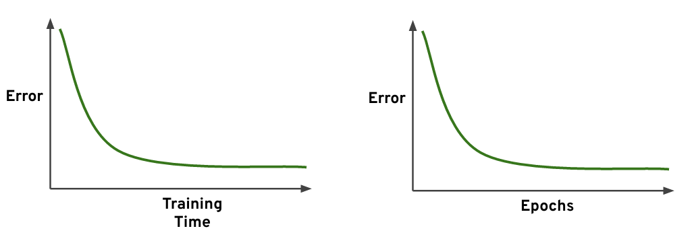

+ Bad model:

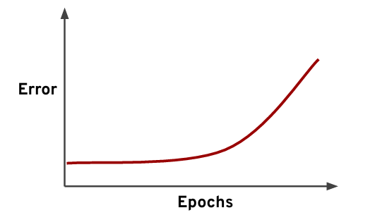

When thinking about overfitting and underfitting we want to keep in mind the relationship of model performance on the training set versus the test validation set.

Let’s imagine we split our data into a **training set** and a **test set**.

+ We first see performance on the **training set**:

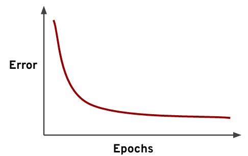

+ Next we check performance on the **test set**. Ideally, the model would perform well on both, with similar behavior:

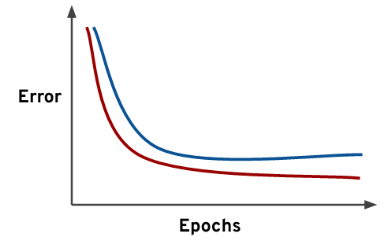

+ But what happens if we overfit on the **training data**? That means we would perform poorly on new **test data**!

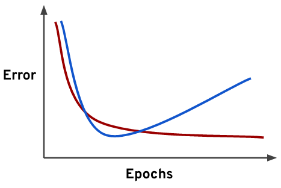

+ This is a good indication of training too much on the **training data**, you should look for the point to cut off training time!

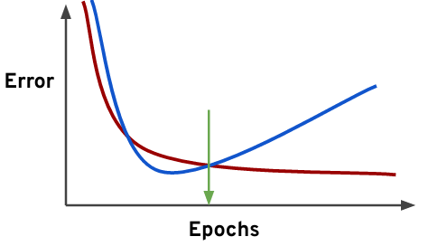

## **Evaluating Performance.**

### **1. Clasification.**

We just learned that after our machine learning process is complete, we will use performance metrics to evaluate how our model did. Let’s discuss classification metrics in more detail! The key classification metrics we need to understand are:

+ Accuracy,
+ Recall,
+ Precision,
+ F1-Score.

But first, we should understand the reasoning behind these metrics and how they will actually work in the real world! Typically in any classification task, your model can only achieve two results: Either your model was correct in its prediction or your model was incorrect in its prediction.

Fortunately incorrect vs correct expands to situations where you have multiple classes, such as trying to predict categories of more than two. For example, you have categories A, B, C, and D, you can either be correct in predicting the correct category or incorrect in predicting the right category.

For the purposes of explaining the metrics, let’s imagine a **binary classification** situation, where we only have two available classes and this idea is going to expand to multiple classes as well.

In my example, we will attempt to predict if an image is a dog or a cat. Since this is supervised learning, we will first fit/train a model on training data, then test the model on testing data. That means we're gonna have images that someone's already gone ahead and labeled dog or cat so we know the correct answer on these images. We're then gonna show new images that the model hasn't seen before get the model's prediction and compare the results of the model's prediction to the correct answer that we already know. Once we have the model’s predictions from the `X_test data`, we compare it to the true `y` values (the correct labels).

+ Let's imagine we've already trained our model on some training data, and now it's time to actually evaluate the model's perfomance. This is where our test dataset comes in:

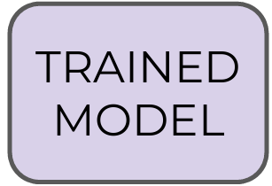

+ We take a test image from what we're gonna label `X_test data`:

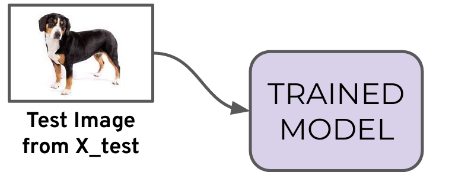

+ And there is a corresponding correct label from `y_test`:

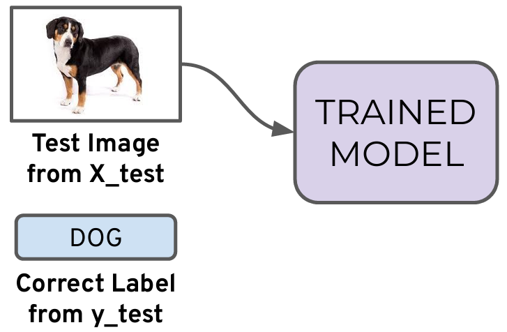

+ The model is going to make some prediction and the model predicts that this is a dog:

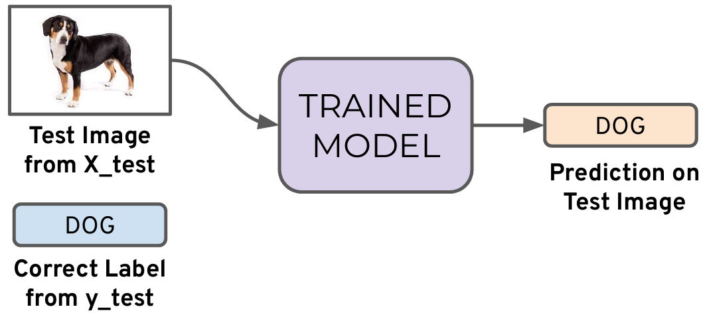

+ We then compare the prediction to the correct label. So the dog equal dog and in this case, it was correct:

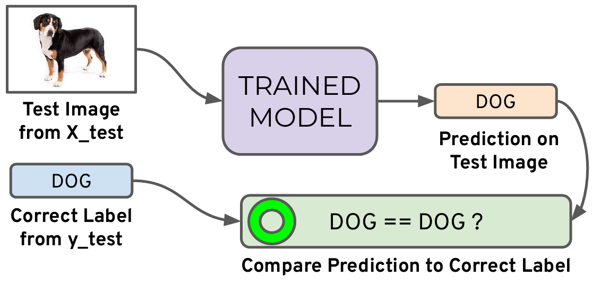

+ However, maybe it predicted that this image was a cat and in this case, this comparition to the correct label would be incorrect:

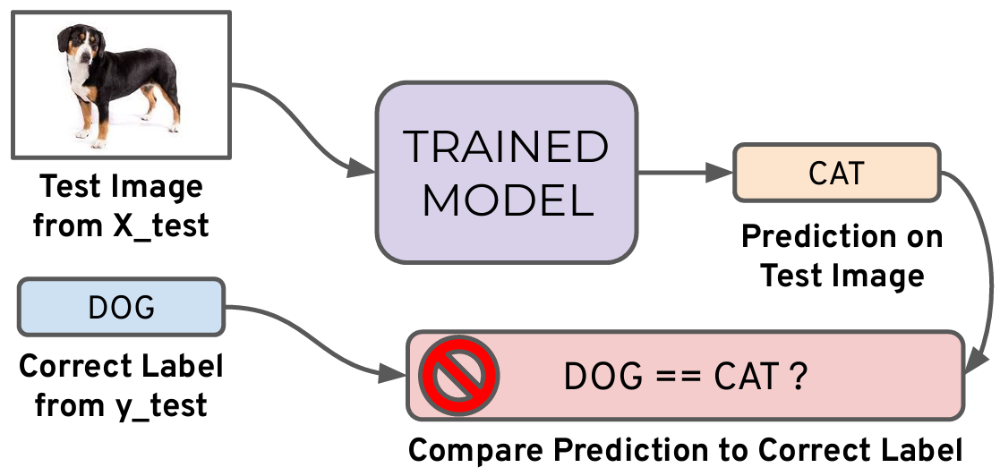

We repeat this process for all the images in our `X_test data`. At the end we will have a count of correct matches and a count of incorrect matches. The key realization we need to make, is that in the real world, not all incorrect or correct matches hold equal value!

Also in the real world, a single metric won’t tell the complete story! To understand all of this, let’s bring back the 4 metrics we mentioned and see how  they are calculated. We could organize our predicted values compared to the real values in a **confusion matrix**.

**a. Accuracy:**

Accuracy in classification problems is *the number of correct predictions made by the model **divided by** the total number of predictions*. For example,if the `X_test` set was 100 images and our model correctly predicted 80 images, then we have 80/100 (0.8 or 80% accuracy).

Accuracy is useful when target classes are well balanced. So what does 'well balanced' means? It means the actual labels themselves are roughly equally represented in the dataset. In our example, we would have roughly the same amount of cat images as we have dog images.

Accuracy is not a good choice with unbalanced classes! Imagine we had 99 images of dogs and 1 image of a cat. If our model was simply a line that 
always predicted dog we would get 99% accuracy!

**b. Recall:**

Ability of a model to find all the relevant cases within a dataset. The precise definition of recall is *the number of true positives **divided by** the number of true positives plus the number of false negatives*.

**c. Precision:**

Ability of a classification model to identify only the relevant data points. Precision is defined as t*he number of true positives **divided by** the number of true positives plus the number of false positives*.

***Recall and Precision:***

Often you have a trade-off between Recall and Precision. While recall expresses the ability to find all relevant instances in a dataset, precision expresses the proportion of the data points our model says was relevant actually were relevant.

**d. F1-score:**

In cases where we want to find an optimal blend of precision and recall we can combine the two metrics using what is called the F1 score. The F1 score is the harmonic mean of precision and recall when taking both metrics into account in the following equation:

$$F_1 = 2\cdot\frac{\text{precision}\cdot\text{recall}}{\text{precision}+\text{recall}}$$

We use the harmonic mean instead of a simple average because it punishes extreme values. A classifier with a precision of 1.0 and a recall of 0.0 has a simple average of 0.5 but an F1 score of 0. 

***Confusion matrix:***

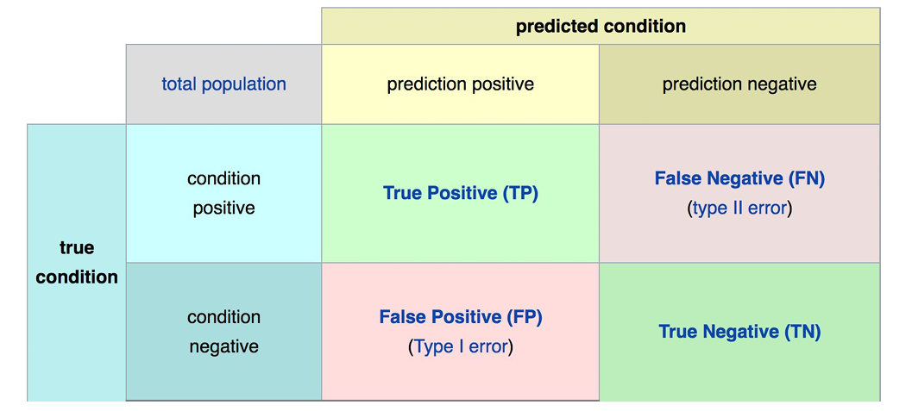

We will explain a little about the two parts: positive and negative predictions, but I will focus on True Positive (TP) and True Negative (TN). For example, your classification model is predicting a person to have a disease, if the person actually has the disease then it will be TP and if the person does not have the disease but the model predicted to have the disease then it will be TN, and for other cases are the same.

After that, there's a lot of other metrics you can calculate:

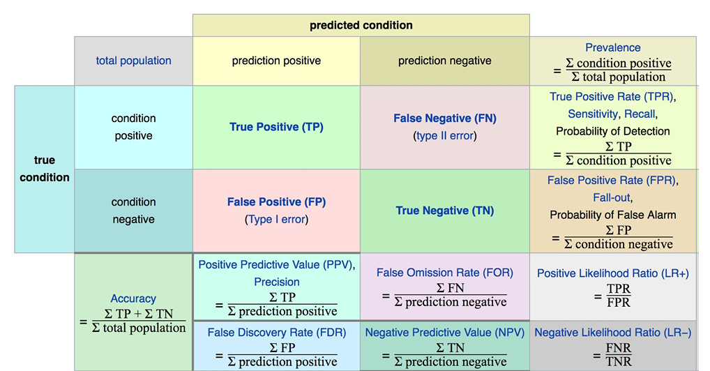

The main point to remember with the confusion matrix and the various calculated metrics is that they are all fundamentally ways of comparing the predicted values versus the true values. What constitutes “good” metrics, will really depend on the specific situation! Still confused on the confusion matrix? No problem! Check out the Wikipedia page for it, it has a really good diagram with all the formulas for all the metrics.

## **Reference source:**

$[1].$ Pierian Data, [Python for Data Science Course](https://pieriantraining.com/learn/python-for-data-science/).

$[2].$ Greeks for Greeks, [ML | Underfitting and Overfitting](https://www.geeksforgeeks.org/underfitting-and-overfitting-in-machine-learning/).

$[3].$ Wikipedia, [Machine learning](https://en.wikipedia.org/wiki/Machine_learning).

$[4].$ Wikipedia, [Supervised learning](https://en.wikipedia.org/wiki/Supervised_learning).

$[5].$ Wikipedia, [Confusion matrix](https://en.wikipedia.org/wiki/Confusion_matrix)