## **The Machine Learning Process.**

This process has three main steps:

**1. Data Pre-Processing:**

+ Import the data.
+ Clean the data.
+ Split into training and test sets.

**2. Modeling:**

+ Build the model.
+ Train the model.
+ Make predictions.

**3. Evaluation:**

+ Calculate the perfomance metrics.
+ Make a verdict. 

## **Traning Set & Test Set.**

Let's imagine that you are tasked to predict the sale prices of cars, and that is your dependent variable and your independent variables are the mileage of the cars (and it ages). In data that are supplied to you, you have 20 cars in a total.

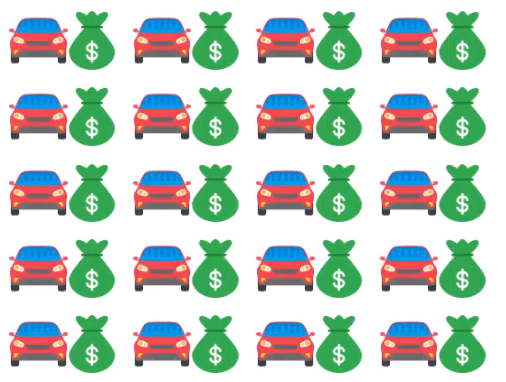

So what it means to shard data is to separate a portion of the data before you do anything, and usually that's about 20% of the data. Since we have 20 cars here, we split it up by about 4 cars.

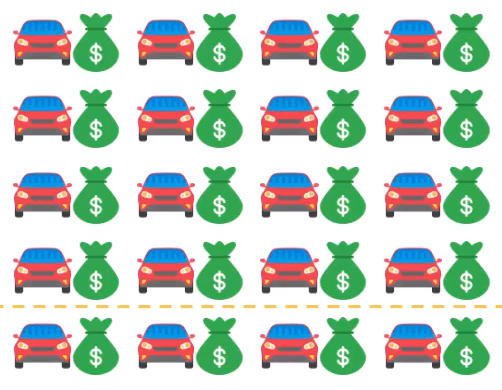

That means is that the bulk of our data 80% will be our training set and the separated 20% will be our test set.

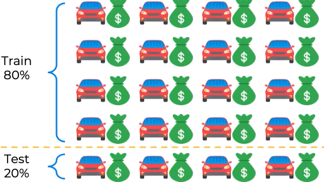

We use our training set to build the model, so in this case we are building a Linear Regression. And then we'll take the cars from the test set, we'll apply our model to them. Therefore, they are not yet involved in the modeling process (the model has no information about these cars and now we're applying this model to them) and it's predicting certain values, certain prices.

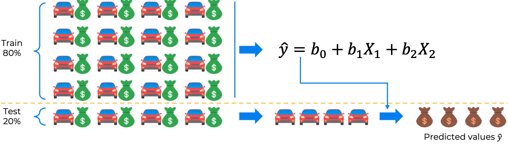

So now we can compare the predicted values which were generated using a model that has never seen this cars before, and we can compare that to the actual values that we know what these cars sold for.

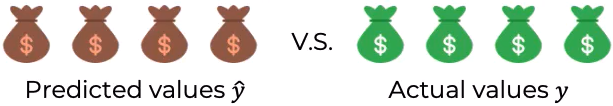

From that we can evaluate our model "Is it doing a good job?" and "We need to improve it?"

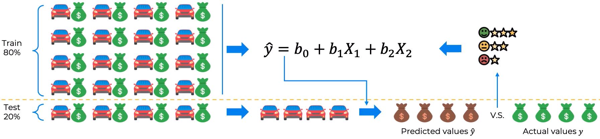

## **Feature Scaling.**

Feature Scaling is always applied to columns. There are multiple types of feature scaling, multiple techniques:

+ **Normalization** is the process of taking the minimum value within a column, subtracting that minimum value from every single value within that column, and then dividing by the difference between the maximum value and the minimum value. Each value in a column is adjusted this way and you will have a new column or an adjusted column with values in the range $[0, 1]$:

$$X' = \frac{X - X_{min}}{X_{max} - X_{min}}, \ X'\in[0, 1]$$

+ **Standardization** is the similar process but instead of subtracting the minimum value, we subtract the average and we divide by the standard deviation. As a result, (almost) all of the values inside the column will be between $[-3, 3]$. If you have some extreme values or some outliers, then they can end up outside of $[-3, 3]$:

$$X' = \frac{X - \mu}{\sigma}, \ X'\in[-3, 3]$$

For example, let's imagine we have a dataset where we have two columns annual income of a person and their age, and we're only going to have three rows:

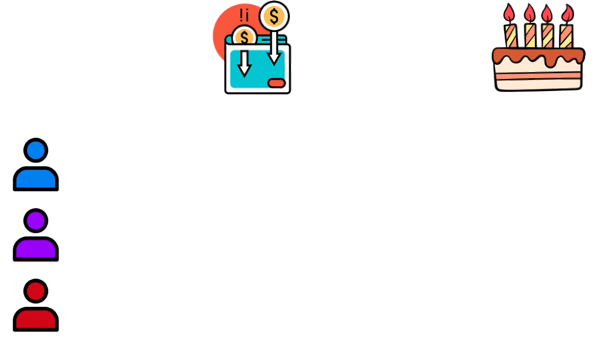

We will fill the cells in this table with data:

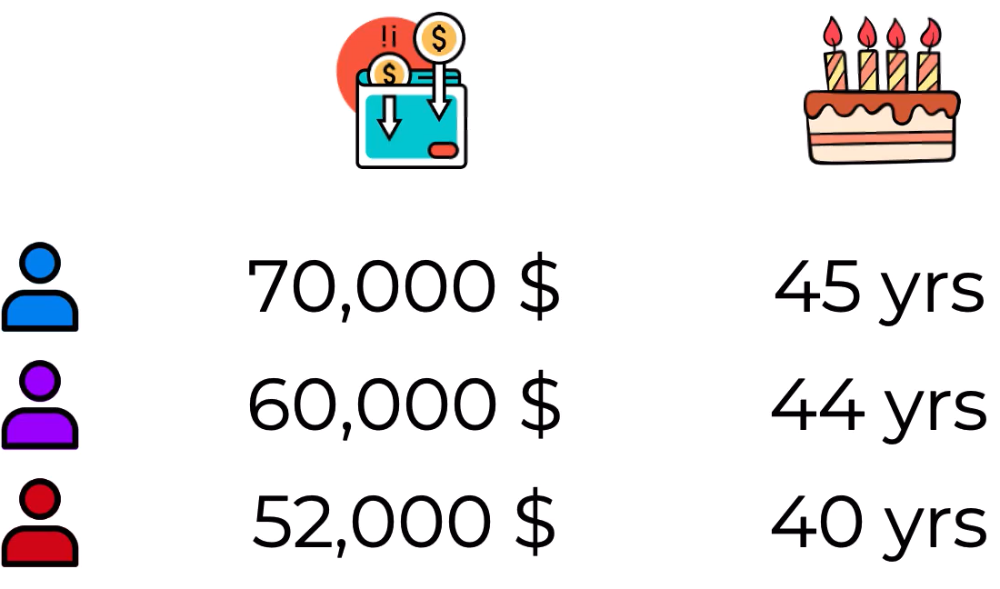

Now the task at hand is going to be slightly different to the regressions and classifications that we've been dicussing. First of all, we will see the difference between rows in the table:

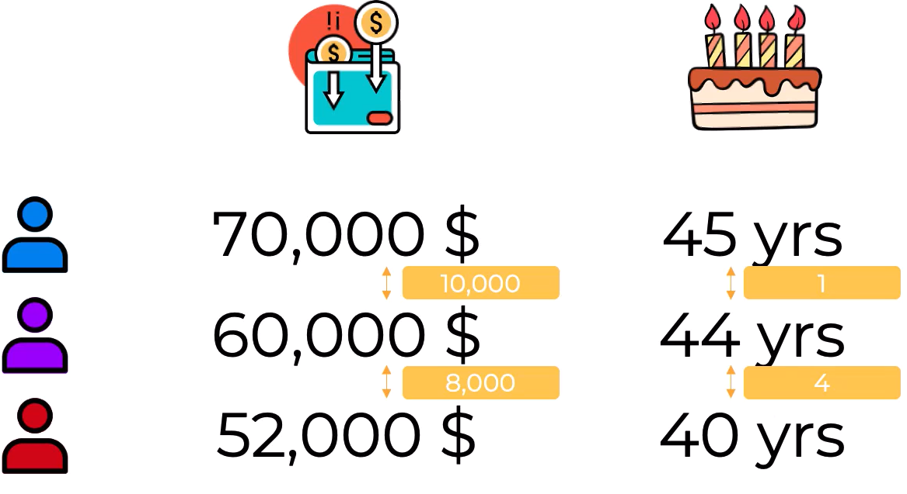

Obviously, the annual income column has a huge difference compared to the age column. So we might make the erroneous conclusion, we're going to ignore values 1 and 4 because those are such small differences compared to 10000 and 8000, we're gonna focus on these larger of magnitude numbers. We'll say that the purple person is clearly closer to the red person because that value is 8000, and we would group the purple person with the red person:

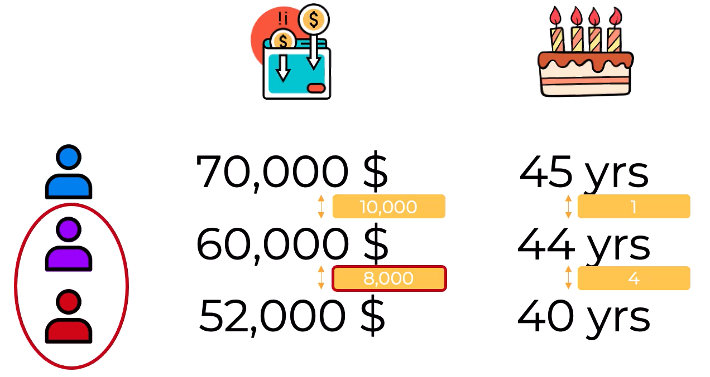

We can't compare salaries by year, and we want to create similar units across the board, so it's important to scale your features. And so let's apply normalization, our values will look like this:

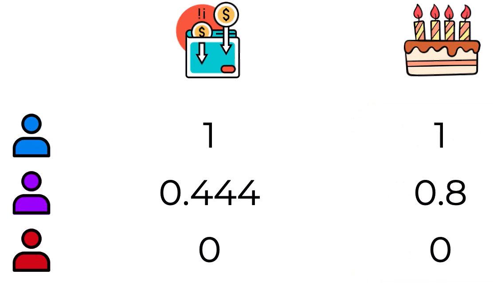

Now we can compare line for line. Obviously, the purple person is almost right in the middle between the red and the blue person, whereas in the age column, the purple person is closest to the blue person and it's very clear:

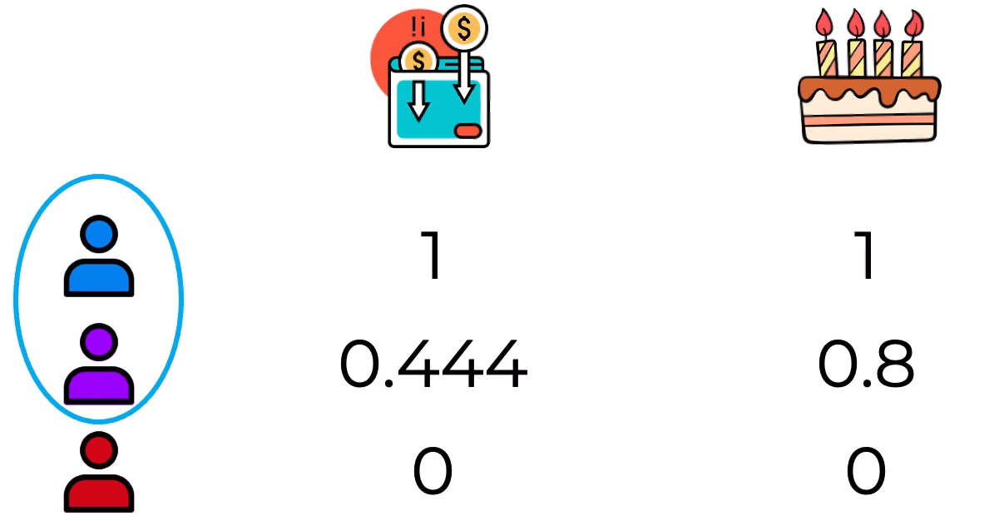