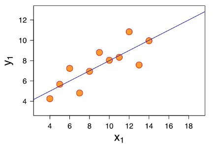
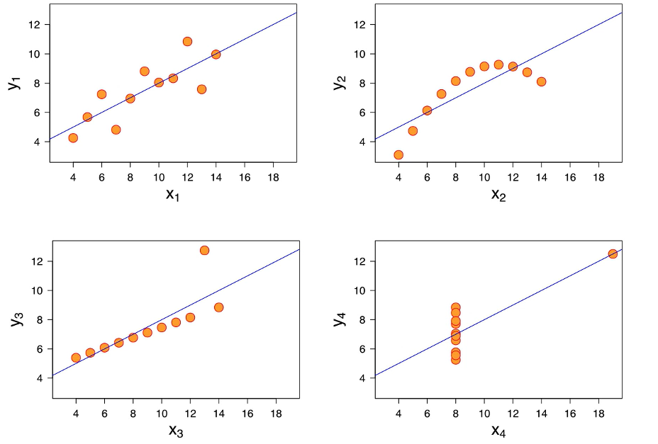

## **Overview.**

The equation of Multiple Linear Regression:

$$\hat{y} = b_0 + b_1X_1 + b_2X_2 + \ldots + b_nX_n$$

In there:

+ $\hat{y}:$ Dependent variable, which we're trying to predict.
+ $X_1, X_2, \ldots, X_n:$ Independent variable, which is the predictor.
+ $b_0:$ $\text{y-intercept}$, also known as the constant.
+ $b_1, b_2, \ldots, b_n:$ The slop coefficient.

We will return to the previous example in Simple Linear Regression to predict the number of potatoes we will get depending on the $kg$ of fertilizer we are using, but we have more what average temperature in the season is and how many millimeters of rainfall we've seen in the season.

For example, the equation of potatoes would be:

$$\text{Potatoes}[t] = 8t + 3[t/kg]\times\text{Fertilizer}[kg] - 0.54[t/^\circ C]\times\text{AvgTemp}[^\circ C] + 0.04[t/mm]\times\text{Rain}[mm]$$

You can read more in [here](https://www.mdpi.com/2073-4395/11/5/885) if you interested in.

## **Assumption.**

We've got a dataset with a Linear Regression applied and this Linear Regression to be serving its purpose very well.

However, if you look at the following three data sets, we can see that Linear Regression applied every time does not serve their purpose, in fact, they are misleading. So we shouldn't be using Linear Regressions in those situations.

These four datasets are called the Anscombe's quarter and they illustrative that you can't just simply, blindly apply Linear Regression, you have to make sure that your dataset is fit for using Linear Regression.

There's going to be five assumptions in total plus an extra check:

1. Linearity: Linear relationship between $Y$ (dependent variable) and each $X$ (independent variable).
2. Homoscedasticity: Equal variance, meaning you don't want to see a cone shape on your graph whether it's a rising cone or a falling cone, that variance depends on the independent variable. So in this case we will also not use Linear Regression.

