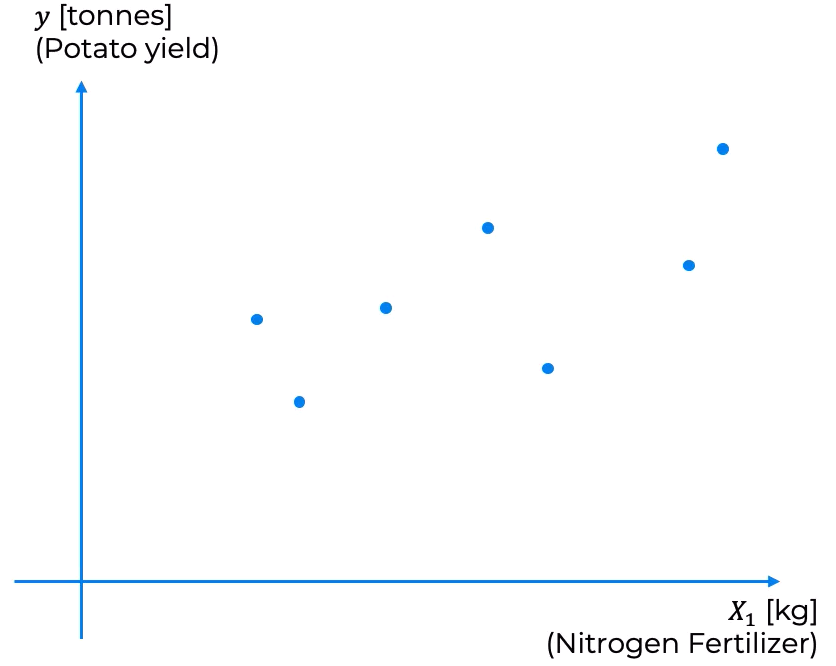
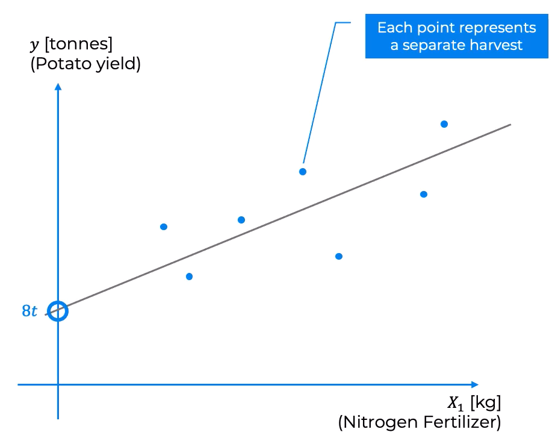
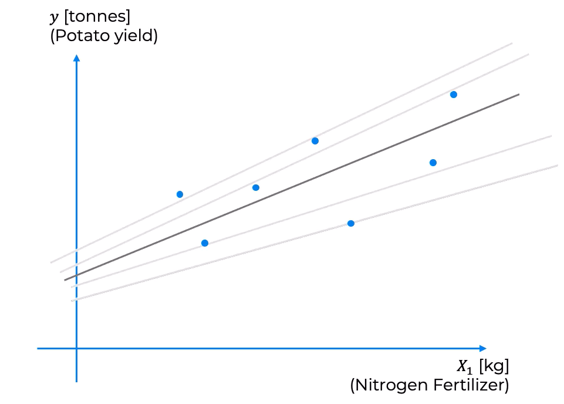
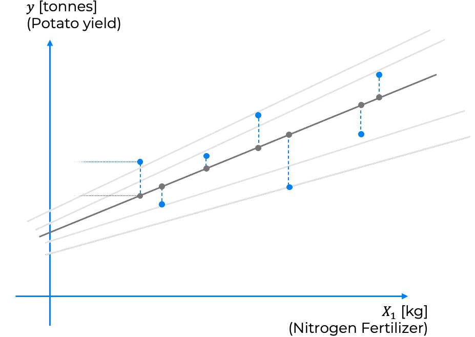
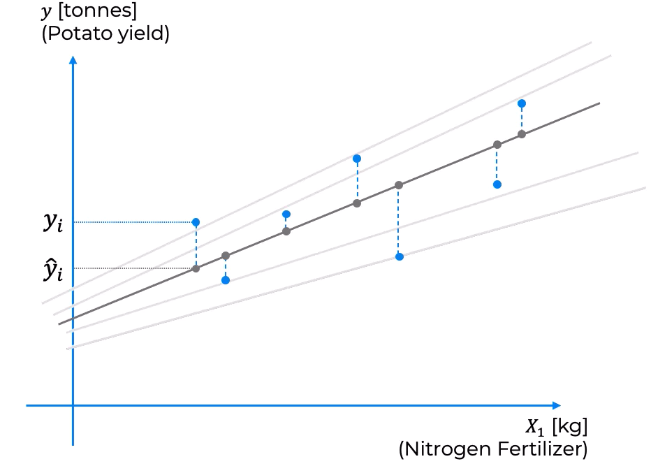

## **Overview.**

The equation of Simple Linear Regression (SLR):

$$\hat{y} = b_0 + b_1X_1$$

In there:

+ $\hat{y}:$ Dependent variable, which we're trying to predict.
+ $X_1:$ Independent variable, which is the predictor.
+ $b_0:$ $\text{y-intercept}$, also known as the constant.
+ $b_1:$ The slop coefficient.

We are going to use that example we mentioned about predicting the output of potatoes on a farm based on the amount of fertilizer that we use:

Here's our equation: $\hat{y} = b_0 + b_1X_1$, and if we modify it to fit our example, it'll look like this:

$$\text{Potatoes}[t \ (\text{tons})] = b_0 + b_1\times\text{Fertilizer}[kg]$$

Let's say that we ran the SLR algorithm, and it came up with the following values: $b_0 = 8[t]$ and $\newline b_1 = 3[t/kg]$. What does it mean in terms of the graphical representation? How can we better understand this on an intuitive level? So let's plot a simple scatter plot:

We have several data points, each one represents a seperate level harvest on the farm. And what this equation on the left represents is a sloped line that goes through our points, the $\text{y-intercept}$ is over here, that $8 \ \text{tons}$:

What the slope coefficient means is that if you increase the amount of nitrogen fertilizer by $1kg$, then the amount of potatoes output will increase by $3 \ \text{tons}$:

## **Ordinary Least Squares.**

How do we know which of the sloped lines is the best one? You can see that there can be multiple slope lines that we could draw through our data points:

In fact, how do we even define the best one? We need to look at the method cal the Ordinary Least Squares (OLS) method. The way it works in a visual sense is we need to take our data points and project them vertically onto our Linear Regression line (LR-line). We would need to do this for every single LR-line that we're considering, but for simplicity's sake in this tutorial, we're just going to do it with this line here in the middle:

For each pair of points, we have two values, $y_i$ and $\hat{y_i}$. $y_i$ is the actual amount of potatoes, in my example, when that specific amount of Nitrogen Fertilizer was used. On the other hand, $\hat{y_i}$ is the linear regression we are looking at that predicts the return that will be achieved.

As you can see, there's a slight difference between the actual value (actual yield) and the predicted yield. It's never going to be perfectly, this line's never gonna go perfectly through every single data, that's simply impossible. But what we want to do is we want to find the best line and it will be related to how small these differences are, as we can imagine.

We will do the following. The difference between $y_i$ and $\hat{y_i}$ is called the residual: $\varepsilon_i = y_i - \hat{y_i}$, we must to find $b_0, b_1$ such that $\sum(y_i - \hat{y_i})^2$ is minimized